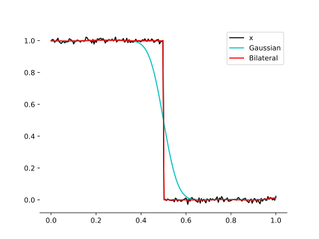

# py-bilateral-filter
A vectorized Bilateral Filter in Python/Numpy. This implementation smoothes signals defined on n-dimensional space and c-dimensional range domains.

The following example compares Gaussian smoothing and Bilateral smoothing on a one dimensional noisy input signal $x(t)$.




## Installation
With Python >= 3.10 execute

```shell
pip install git+https://github.com/cheind/py-bilateral-filter.git
```

## Usage

```python
import numpy as np

from bilateral import bilateral_filter

# 1-d space signal with 1 channel
s = np.random.randn((100,1)) * 1e-2
sf = bilateral_filter(s, sigma_space=10, sigma_channel=0.1).squeeze()

# 1-d space signal with 3 channels
s = np.random.randn((100,3)) * 1e-2
sf = bilateral_filter(s, sigma_space=10, sigma_channel=0.1).squeeze()

# 2-d space signal with 3 channels
s = np.random.randn((100,100,3)) * 1e-2
sf = bilateral_filter(s, sigma_space=10, sigma_channel=0.1).squeeze()
```

## Background

Here we consider a signal $x$ having domain S in N-dimensional
space and range R in C-dimensional space. The bilateral filtered
signal $y$ at space location $p$ is given by
```math
\begin{align}
    y(p) &= \frac{1}{w(p)} \sum_{q \in S}w(q,p)x_q \\
    w(q,p) &= G_s(|q-p|)G_c(|x_q-x_p|) \\
    w(p) &= \sum_{q \in S}w(q,p)
\end{align}
```
here $G_s$ and $G_c$ are unnormalized Gaussians with user defined variances. For the vectorized version we consider each *contributing* n-dimensional space shift $o$
and compute for all pixel location 'p' in parallel

```math
\begin{align}
    y(p) &= \frac{1}{w(p)} \sum_{o} w(p-o,p)x_{p-o} \\    
    w(p) &= \sum_{o} w(p-o,p).
\end{align}
```

The contributing shifts are computed from the cut-off kernel size
$k=2r(1.5\sigma_s)+1$, where $r$ rounds to nearest integer This provided method is vectorized, but still slow for large sigma values, because it requires $O(|S|*|k|^S)$ evaluations.


## More examples

The script [demo.py](demo.py) also contains a 2D filter comparison. 


## Notes

While Gaussian filtering can be represented as a linear convolution
with a fixed kernel, Bilateral filtern cannot as it a) requires
a non-linear normalization factor and the range kernel depends
on the actual signal values. See [1] for a linear formulation
in a homogeneous space of higher dims.


## References
[1] Paris, Sylvain, and Frédo Durand. "A fast approximation of the bilateral filter using a signal processing approach.


